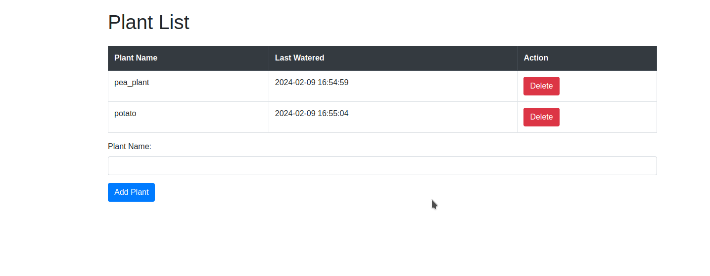
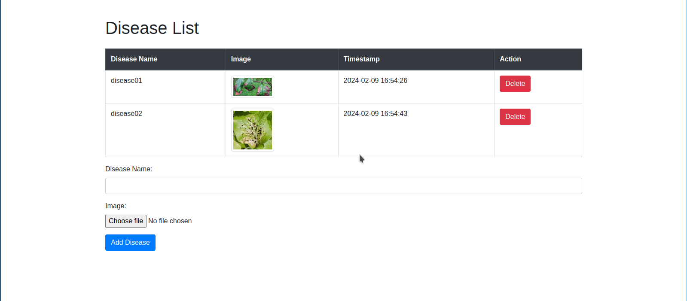

## Project
* GPT-3 prompt used to make this project: https://chat.openai.com/share/fec849a4-6fcf-4e53-b9f6-2fb9a85aac66
* open in vs code
* activate virtual environment
* install SQLAlchemy with command: `pip install SQLAlchemy`
* run main.py
* run `main.py` file with command: `python3 main.py` or `python main.py`
* there are two pages:
    * http://127.0.0.1:5000/display_plants
    * http://127.0.0.1:5000/display_diseases
* when you open the urls, the pages should look like the followings:

## Watering page preview

## Disease page preview

